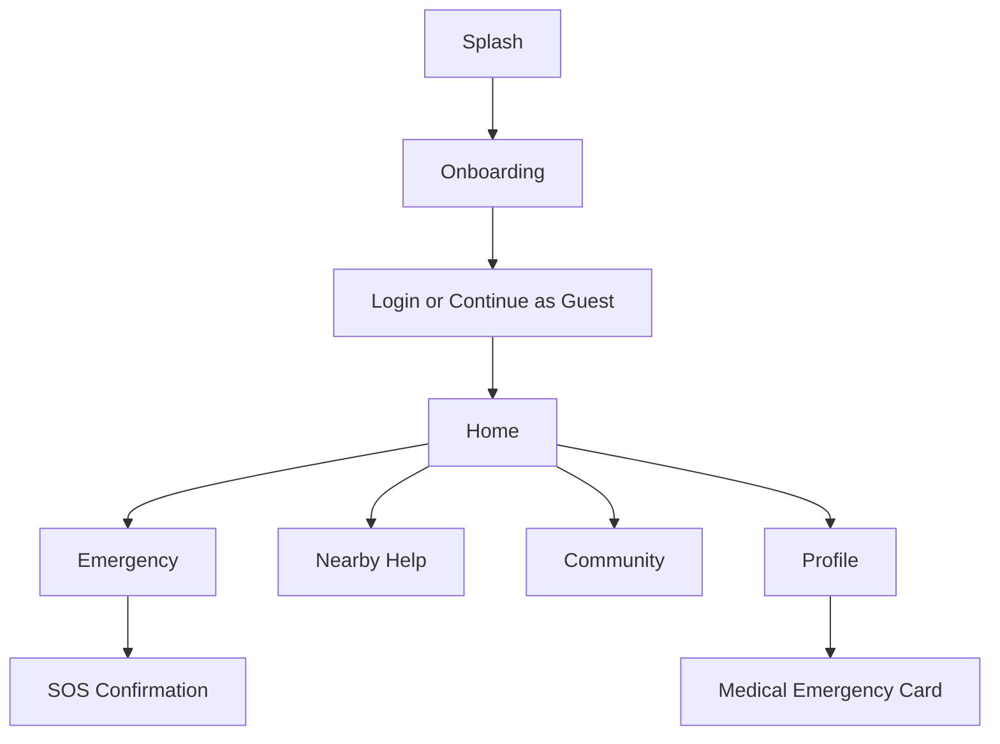

# LifeLine Connect

<p align="center">
  
</p>

<p align="center">
  <strong>A premium Android emergency assistance and community support prototype for India.</strong>
</p>

<p align="center">
  Built as a calm, professional, white-theme mobile experience focused on helping people access the right support faster during urgent situations.
</p>

<p align="center">
  
  
  
  
  
  
</p>

<p align="center">
  <a href="#overview">Overview</a> •
  <a href="#features">Features</a> •
  <a href="#design-system">Design System</a> •
  <a href="#screens">Screens</a> •
  <a href="#assets">Assets</a> •
  <a href="#setup">Setup</a> •
  <a href="#roadmap">Roadmap</a>
</p>

---

## Overview

LifeLine Connect is a white-theme Android application prototype designed to help users quickly access emergency assistance, nearby essential services, trusted contacts, and community support through a stress-friendly mobile interface. The concept is realistic for Android prototyping because Google AI Studio can generate native Android apps using Kotlin and Jetpack Compose, and Android guidance recommends Jetpack Compose for modern maintainable UI generation.[web:49][web:45][web:56]

The app is intentionally positioned as a citizen-support and community-assistance platform for India, not as a replacement for official emergency dispatch infrastructure. This positioning makes the concept more feasible, responsible, and practical for a hackathon-ready prototype.[web:49][web:56]

---

## Problem

In urgent situations, people often waste critical time searching through contacts, maps, hospitals, pharmacies, donor networks, and local support resources. A single mobile interface that centralizes these actions can reduce panic, simplify decisions, and improve response speed during stressful moments.[web:49][web:56]

LifeLine Connect addresses this need by combining SOS workflows, nearby help discovery, personal medical readiness, and community support into one clean experience. The result is a socially useful product concept with strong hackathon potential and clear public impact.[web:49][web:56]

---

## Solution

LifeLine Connect offers a unified emergency-support experience with high-visibility actions, structured information, and a professional UX that feels calm rather than alarming. The prototype is designed for quick demonstration, realistic expansion, and strong judge appeal.[web:49][web:56]

### Core value proposition

> **Help people reach the right support faster — with less panic, fewer steps, and better clarity.**

---

## Features

### Emergency-first experience
- One-tap SOS with confirmation flow.
- Live location sharing with trusted contacts.
- Emergency contact shortcuts.
- First-response guidance cards.
- Quick “I am safe” status update.
- Clear priority-based emergency actions.

### Nearby help discovery
- Hospitals
- Pharmacies
- Blood banks
- Police stations
- Shelters
- Volunteer support points
- Search, filter, and category chips
- Call and navigate actions

### Community support
- Verified volunteer listings
- Blood donor discovery
- Community helper cards
- Request help flow
- Offer help flow
- Trust indicators and badges

### Personal readiness
- Medical emergency card
- Blood group
- Allergies
- Chronic conditions
- Medications
- Emergency contacts
- Saved addresses
- Preferred language settings

---

## Why this project stands out

LifeLine Connect is designed to be useful for students, families, elderly users, women traveling alone, caregivers, apartment communities, and campus residents. That wide relevance makes it a strong social-impact hackathon project with clear real-world usefulness.[web:49][web:56]

It also combines product thinking, mobile UX, design clarity, and public utility in a way that looks more like a serious startup prototype than a basic student app. The use of modern Android patterns such as Kotlin and Jetpack Compose further strengthens its implementation credibility.[web:49][web:45][web:56]

---

## Design system

### Visual direction
- White-first interface
- Soft neutral surfaces
- Minimal blue or teal accent
- Rounded corners
- Subtle elevation
- Strong typography hierarchy
- Accessible spacing
- Calm and professional tone

### Typography
- Primary font direction: **Google Sans**
- Fallback approach: use the closest visually similar supported implementation if needed
- Google Sans is listed on Google Fonts, and Android supports downloadable font workflows through font resources and downloadable font integration paths.[web:37][web:51][web:53][web:55]

### UI principles
- Design for clarity under stress
- Large touch targets
- One primary action per screen
- Minimize cognitive load
- Keep critical actions visible
- Avoid clutter and visual noise
- Use readable hierarchy over decoration

### Component library
- Primary button
- Secondary button
- Ghost button
- Alert card
- Information card
- Search bar
- Service card
- Volunteer card
- Medical card
- Bottom navigation
- Bottom sheet
- Dialog
- Status chip
- Empty state block
- Loading shimmer
- Settings row

---

## Screens

### Primary navigation
| Section | Purpose |
|---|---|
| Home | Dashboard with SOS, shortcuts, location preview, and quick access |
| Emergency | High-priority actions, SOS confirmation, medical readiness |
| Nearby Help | Discover nearby hospitals, pharmacies, blood banks, police, shelters |
| Community | Volunteers, donors, support requests, local helpers |
| Profile | Personal details, emergency card, settings, language, contacts |

### Full screen list
- Splash
- Onboarding
- Welcome / Login
- OTP Verification
- Home
- Emergency
- Nearby Help
- Community
- Profile
- Edit Profile
- Medical Emergency Card
- Notifications
- Settings
- Help Request Dialog
- SOS Confirmation Bottom Sheet
- Empty States
- Loading States

---

## User flow



---

## Information architecture

### Home
- Greeting header
- Search input
- Main SOS card
- Quick action grid
- Nearby location preview
- Tips and alerts section
- Recent activity
- Trusted contact shortcuts

### Emergency
- Large emergency action
- Alert confirmation sheet
- Contact actions
- First-aid information
- Medical profile summary
- Nearest help recommendation

### Nearby Help
- Search field
- Category filter chips
- Placeholder map area
- Service cards
- Distance and status indicators
- Call and navigate buttons

### Community
- Volunteer cards
- Donor support cards
- Trust score badges
- Request help block
- Offer help block
- Recent support activity

### Profile
- User details
- Blood group and conditions
- Emergency contacts
- Saved addresses
- Language selector
- Privacy and notifications
- Download/share emergency card

---

## Tech stack

LifeLine Connect is designed as a native Android prototype using Kotlin and Jetpack Compose, which aligns with Google AI Studio’s Android app generation support and Google’s recommended modern Android UI patterns.[web:49][web:45][web:52][web:56]

### Recommended stack
- Kotlin
- Jetpack Compose
- Material 3
- Compose Navigation
- ViewModel-ready architecture
- Fake repository / mock data layer
- Modular UI components
- Android font resources for typography support.[web:51][web:53][web:55]

---

## Repository structure

```text
LifeLine-Connect/
├── app/
│   ├── src/main/java/com/yourpackage/lifelineconnect/
│   │   ├── data/
│   │   ├── model/
│   │   ├── navigation/
│   │   ├── ui/components/
│   │   ├── ui/screens/
│   │   ├── ui/theme/
│   │   └── viewmodel/
│   ├── src/main/res/
│   │   ├── drawable/
│   │   ├── mipmap/
│   │   ├── values/
│   │   └── font/
│   └── build.gradle
├── assets/
│   ├── branding/
│   ├── icons/
│   ├── illustrations/
│   ├── mockups/
│   └── posters/
├── screenshots/
│   ├── 01-splash.png
│   ├── 02-onboarding.png
│   ├── 03-home.png
│   ├── 04-emergency.png
│   ├── 05-nearby-help.png
│   ├── 06-community.png
│   ├── 07-profile.png
│   └── 08-medical-card.png
├── docs/
│   ├── architecture.md
│   ├── design-guidelines.md
│   ├── problem-statement.md
│   ├── demo-script.md
│   └── future-scope.md
├── prompt/
│   └── master-prompt.md
└── README.md
```

---

## Assets

This README is structured to support a visually rich professional repository presentation.

### Branding assets
- `./assets/branding/cover-banner.png`
- `./assets/branding/logo-mark.png`
- `./assets/branding/logo-wordmark.png`
- `./assets/branding/app-icon.png`

### UI illustration assets
- `./assets/illustrations/onboarding-1.png`
- `./assets/illustrations/onboarding-2.png`
- `./assets/illustrations/onboarding-3.png`
- `./assets/illustrations/empty-state-support.png`
- `./assets/illustrations/empty-state-nearby-help.png`

### Mockup assets
- `./assets/mockups/demo-preview.gif`
- `./assets/mockups/device-mockup-home.png`
- `./assets/mockups/device-mockup-emergency.png`

### Poster and pitch assets
- `./assets/posters/problem-solution-board.png`
- `./assets/posters/feature-summary.png`
- `./assets/posters/hackathon-pitch-cover.png`

---

## Visual showcase

### Cover banner
```md

```

### Logo
```md
<p align="center">
  
</p>
```

### Screen previews
```md
<p align="center">
  
  
  
  
</p>
```

### Extended preview strip
```md
<p align="center">
  
  
  
  
</p>
```

### Demo GIF
```md

```

---

## Setup

### Prerequisites
- Android Studio
- Android SDK
- Kotlin support
- Jetpack Compose enabled project
- Emulator or physical Android device
- Google AI Studio or Android Studio AI workflow for prompt-based project generation.[web:49][web:45][web:52]

### Clone
```bash
git clone https://github.com/your-username/lifeline-connect.git
cd lifeline-connect
```

### Run locally
1. Open the project in Android Studio.
2. Sync Gradle.
3. Run on an emulator or Android device.
4. Replace placeholder assets and mock data where needed.

---

## Demo strategy

For a strong hackathon presentation, use this sequence:

1. Open with the splash screen and branding.
2. Show onboarding and the clean white-theme UI.
3. Land on Home and present the SOS-first dashboard.
4. Trigger the SOS confirmation flow.
5. Navigate to Nearby Help and show realistic service cards.
6. Open the Medical Emergency Card.
7. Close with Community support to emphasize public value and scalability.

This demo path highlights both urgency-focused UX and broader social utility in a short presentation window.[web:49][web:56]

---

## Real-world positioning

LifeLine Connect should be presented as an emergency assistance and community support product for India rather than as a direct replacement for official emergency dispatch systems. That framing is more practical for prototype development and more credible for hackathon presentation.[web:49][web:56]

---

## README enhancement ideas

To make this repository look even more premium, add:

- A custom banner designed in the app’s white-theme style
- Device mockups for 4 to 8 screens
- A short GIF showing onboarding to SOS flow
- Architecture diagram in `docs/architecture.md`
- Figma link
- Pitch deck link
- Demo video thumbnail
- Product poster board
- App icon preview block
- Changelog section
- Release notes section

---

## Roadmap

### Product roadmap
- [ ] Live map integration
- [ ] Real-time geolocation
- [ ] Verified local partner onboarding
- [ ] Multilingual releases
- [ ] Offline emergency mode
- [ ] High-risk area alerts
- [ ] Institutional dashboard support
- [ ] AI-assisted urgency suggestions with clear disclosure

### Technical roadmap
- [ ] API integration layer
- [ ] Authentication backend
- [ ] Push notifications
- [ ] Offline caching
- [ ] Automated UI tests
- [ ] Analytics events
- [ ] Production build pipeline
- [ ] Accessibility audit

---

## Contributing

Contributions can focus on:
- Android UI improvements
- Compose architecture cleanup
- Accessibility refinement
- Localization support
- Better mock data quality
- Documentation polish
- Asset creation
- Demo presentation quality

```bash
git checkout -b feature/improve-home-dashboard
```

---

## Documentation extras

Recommended additional files:

- `docs/architecture.md`
- `docs/design-guidelines.md`
- `docs/problem-statement.md`
- `docs/demo-script.md`
- `docs/future-scope.md`
- `docs/judging-highlights.md`

---

## Professional repo checklist

- [ ] Add cover banner
- [ ] Add logo mark and wordmark
- [ ] Add screenshots
- [ ] Add device mockups
- [ ] Add demo GIF
- [ ] Add architecture notes
- [ ] Add pitch deck
- [ ] Add Figma link
- [ ] Add license
- [ ] Add acknowledgements

---

## License

Choose one:
- MIT
- Apache-2.0
- Custom academic/demo license

---

## Acknowledgements

- Android app generation direction is aligned with Google AI Studio and Android Studio prompt-based Android workflows that support Kotlin and Jetpack Compose generation.[web:49][web:45][web:52][web:56]
- Typography direction references Google Sans availability and Android downloadable font support patterns.[web:37][web:51][web:53][web:55]

---

## Tagline

> **LifeLine Connect — a calm, fast, and trustworthy emergency-support experience designed for real people in real situations.**
